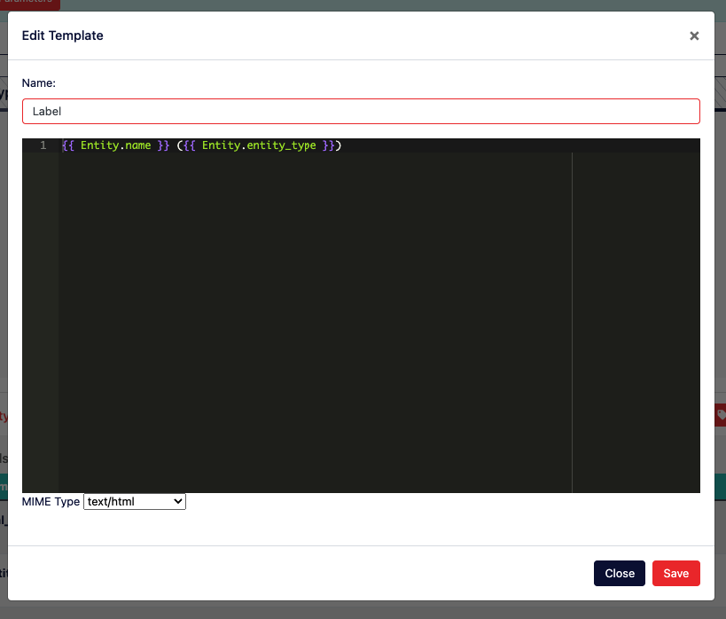
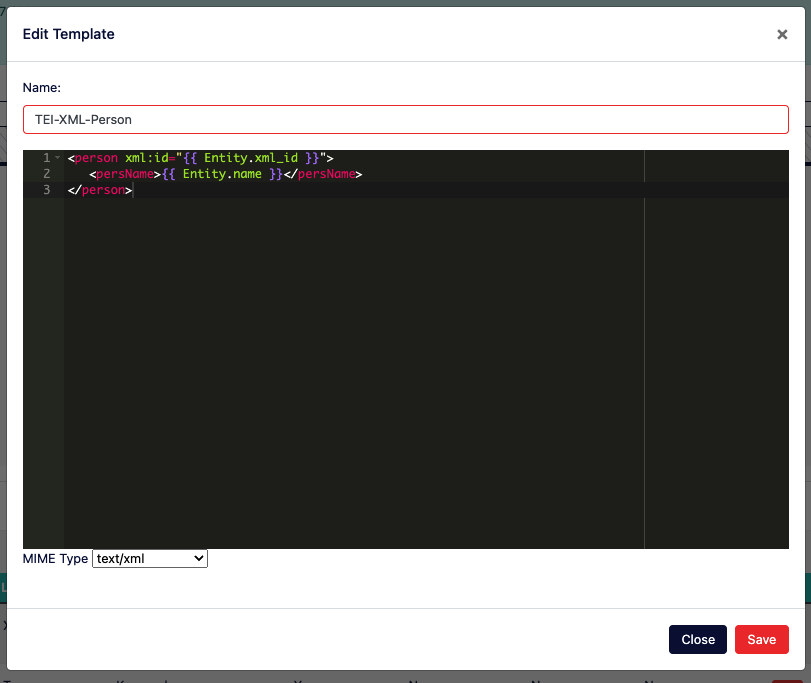
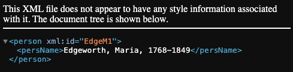

# Developing

Corpora was built with the DH developer in mind just as much as the DH scholar. It was created as a way to flexibly handle a wide variety of DH projects with minimal effort while also empowering the developer to focus on the more innovative aspects of a given project. Below are detailed the affordances of corpora tailored specifically for developers, listed in order of complexity.


## Content Type Templates

From a developer's perspective, a [Content Type](/#content-type) in Corpora is a class whose properties and methods are largely defined by the Content Type Manager (essentially a data schema editor) available on the Admin tab of a given corpus. Content Type Templates are the convention Corpora uses to allow developers to control how instances of content get *rendered*, whether as a textual label, an HTML snippet, a JavaScript component, an XML document, etc. This rendering is done using [the Jinja2-style Django template convention](https://docs.djangoproject.com/en/5.0/ref/templates/), and indeed it's recommended to refer to Django's documentation when editing or creating templates (particularly as a reference for [Django's built-in template tags](https://docs.djangoproject.com/en/5.0/ref/templates/builtins/#built-in-tag-reference)).

### Editing Label Templates

By way of example, let's consider the following Content Type used to keep track of named entities throughout a corpus of XML documents:


There are four fields defined for this Content Type, which means any instance of this content will be an object with at least four properties. If we were to name an instance of this class `Entity`, then you'd access its four properties like this using pseudocode:

````python
Entity.xml_id
Entity.entity_type
Entity.name
Entity.uris
````

There are also always three more hidden properties available for any instance of Content:

````python
Entity.id       # a unique, alphanumeric identifier
Entity.uri      # a unique URI for this content which includes its corpus ID
Entity.label    # a textual representation of the content
````

The `label` property for any given piece of content in Corpora is generated using the template called "Label" which can be edited using the Content Type Manager.

To edit the Label template, go to the Admin tab of your corpus, scroll to the Content Type Manager, and expand out the tray for a given Content Type. Scroll to the bottom of that tray, and locate in the footer of the table that lists the fields for your Content Type the dropdown prefixed with the label "Edit Template." Click the "Go" button to begin editing the template used by Corpora to generate textual labels for that Content Type:



In this particular case, the template for our label looks like this:

````django
{{ Entity.name }} ({{ Entity.entity_type }})
````

When editing a Content Type template in Corpora, the template's "namespace" has available to it an instance of the content *named the same as the Content Type* (i.e. `Entity`). Django's templating system has a convention whereby you can dynamically insert the value for an object's property by surrounding it with double curly-braces. So to output the value of your Entity's `name` property in a template, you'd use:

````django
{{ Entity.name }}
````

Notice this is how our template example begins. The rest of the example includes a space, open parenthesis, the output of the value for the Entity's `entity_type` field, and then a closing parenthesis. Given this template, if our instance of the Entity Content Type had the value "Maria Edgeworth" for the field `name`, and "PERSON" for the field `entity_type`, the textual label for that piece of content would look like this:

````django
Maria Edgeworth (PERSON)
````

Django's templating system is powerful, as it also provides affordances for boolean logic in the form of if/else statements. Let's say we want our label template to be a little more sophisticated by having it provide default values for fields that have no value. In this case, we'll leverage Django's built-in `` [syntax](https://docs.djangoproject.com/en/5.0/ref/templates/builtins/#if):

````django
{{ Entity.name }}Unknown ({{ Entity.entity_type }}UNKNOWN)
````

Using this new template, if the Entity's `name` property has no value, the string "Unknown" will be output. Similarly, if `entity_type` has no value, "UNKNOWN" will be output.

Note that when you make changes to a template in Corpora's Content Type Manager, you must click the orange "Save" button on the "Edit Template" modal, *and must also* click the orange "Save Changes" button in the footer of the Content Type Manager for template changes to be "committed" to your data schema. Also note that when the Label template is changed, Corpora automatically fires off a reindexing task for the Content Type in question, as well as for any other Content Types in your corpus that reference the Content Type in question. Depending on how many instances of these Content Types you have in your corpus, this reindexing may take some time.

### Creating New Templates

Beyond specifying how content labels get created, Corpora's Content Type templating system allows you to create almost any kind of web-based representation of your content by allowing you to build a template and choose the appropriate [MIME type](https://en.wikipedia.org/wiki/Media_type) for that representation.

Building off our `Entity` example, let's say you wanted to create [TEI XML](https://tei-c.org/) representations for entities in your corpus. In the Content Type Manager for your corpus, you'd expand out the tray for your Content Type and, next to the "Go" button for editing an existing template, you'd click the "New Template" button to bring up the template editor:



Give your template a URL-friendly name (no spaces or special characters), provide the content for your template, and choose an appropriate MIME Type (in this case, text/xml so we can serve up XML for the output of this template). In case the image above is too small or blurry, here's the content for this template:

````xml
<person xml:id="{{ Entity.xml_id }}">
   <persName>{{ Entity.name }}</persName>
</person>
````

Click the "Save" button on the template editing modal, and then click "Save Changes" at the bottom of the Content Type Manager. Once this happens, your new template is available to be rendered.

### Viewing Rendered Templates

To view the output of a template for an instance of content, you'll need to construct a URL that follows this convention:

````html
[Your Corpora Instance]/corpus/[Corpus ID]/[Content Type]/[Content ID]/?render_template=[Template Name]
````

In this example, let's assume your Corpora instance is hosted at `https://mycorpora.org`, your Corpus ID is `62f554a9837071d8c4910dg`, the Content Type is `Entity`, the ID for your instance of Entity is `6691462b32399974cfc2cb1a`, and the template you want to render is our new `TEI-XML-Person` template. Given these assumptions, the URL would look like:

````html
https://mycorpora.org/corpus/62f554a9837071d8c4910dg/Entity/6691462b32399974cfc2cb1a/?render_template=TEI-XML-Person
````

Your browser should then display the rendered output for your content as an XML document (screenshot from Google Chrome):

